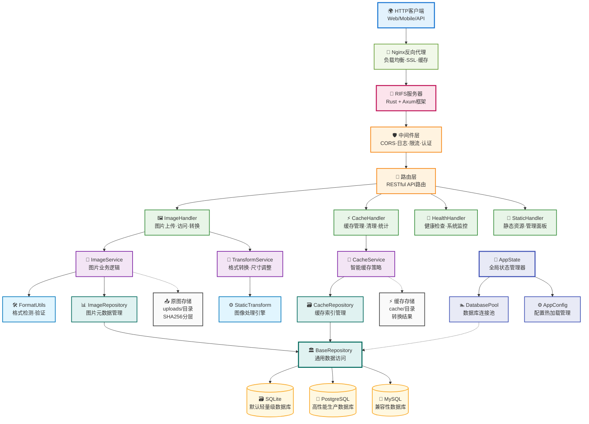

# RIFS - Rust图床服务完整文档

<div align="center">


<p>
  
  
  
  
</p>

**🚀 高性能 Rust 图床服务 • 支持实时转换和智能缓存**

</div>

---

## ⚠️ 重要声明

<div align="center">

**🤖 本项目完全由 AI (Claude) 生成和编写 🤖**

**此项目包括所有代码、文档、配置文件等均为人工智能自动生成**  
**请在使用前仔细检查和测试，AI生成的代码可能存在潜在问题**  
**不建议直接用于生产环境，需要经过充分的测试和验证**

</div>

---

## 📖 目录

- [项目概述](#项目概述)
- [系统架构](#系统架构)
- [快速开始](#快速开始)
- [功能特性](#功能特性)
- [使用示例](#使用示例)
- [API接口文档](#api接口文档)
- [配置说明](#配置说明)
- [前端开发指南](#前端开发指南)
- [移动端适配](#移动端适配)
- [项目结构](#项目结构)
- [开发指南](#开发指南)
- [部署指南](#部署指南)
- [更新日志](#更新日志)

---

## 项目概述

RIFS (Rust Image File Server) 是一个高性能的图床服务，使用 Rust 编写，支持多种图片格式的实时转换和智能缓存。项目采用现代化的架构设计，提供 Web 应用和 Tauri 桌面应用两种形式。

### 核心特性

- **高性能** - Rust编写，内存安全，高并发处理
- **多格式支持** - 支持JPEG、PNG、GIF、WebP、AVIF、ICO 6种主流图片格式
- **实时转换** - 通过URL参数进行图片尺寸、格式、质量转换
- **智能缓存** - 自动缓存转换结果，支持LRU清理策略
- **去重存储** - SHA256哈希去重，避免重复存储
- **管理面板** - 内置Web管理界面，支持缓存管理和系统监控
- **用户管理** - 基于角色的访问控制，支持管理员和普通用户
- **跨平台** - 支持Web、Windows、macOS、Linux

---

## 系统架构



---

## 快速开始

### 本地运行

```bash
# 克隆项目
git clone https://github.com/djkcyl/rifs.git
cd rifs

# 运行
cargo run --release
```

### Docker 运行

```bash
docker run --rm --pull always -d \
  -p 3000:3000 \
  -v ./uploads:/app/uploads \
  -v ./cache:/app/cache \
  -v ./data:/app/data \
  -v ./config.toml:/app/config.toml \
  djkcyl/rifs:latest
```

### Tauri 桌面应用

```bash
# 安装依赖
npm install

# 开发模式
npm run tauri:dev

# 生产构建
npm run tauri:build
```

---

## 功能特性

### 🖼️ 图片管理
- **上传图片**：支持拖拽上传、批量上传
- **图片浏览**：网格视图、详情查看
- **图片转换**：自动格式转换、尺寸调整
- **缓存管理**：智能缓存策略、自动清理

### 👥 用户管理
- **角色权限**：管理员和普通用户两种角色
- **访问控制**：基于角色的页面和API访问限制
- **资源隔离**：用户只能访问自己的图片
- **Token管理**：安全的API令牌认证

### 🔧 系统配置
- **动态API地址**：支持运行时配置后端地址
- **环境变量**：支持通过环境变量配置
- **本地存储**：用户配置持久化保存

### 技术特性

#### 🚀 高性能
- **Rust后端**：内存安全、高性能
- **异步处理**：基于Tokio的异步架构
- **图片优化**：自动格式优化和压缩
- **智能缓存**：多级缓存策略

#### 🔒 安全性
- **Token认证**：安全的API令牌机制
- **权限控制**：细粒度的角色权限管理
- **数据隔离**：用户数据完全隔离
- **输入验证**：严格的参数验证

#### 🌐 跨平台
- **Tauri应用**：支持Windows、macOS、Linux
- **Web应用**：支持现代浏览器
- **响应式设计**：适配各种屏幕尺寸
- **PWA支持**：渐进式Web应用

### 用户角色

#### 管理员 (Admin)
- ✅ 访问所有功能
- ✅ 用户管理
- ✅ 缓存管理
- ✅ 系统设置
- ✅ 查看所有图片

#### 普通用户 (User)
- ✅ 上传图片
- ✅ 查看自己的图片
- ✅ 基本图片操作
- ❌ 用户管理
- ❌ 缓存管理
- ❌ 系统设置

---

## 使用示例

### 上传图片

```bash
# 基础上传
curl -F "file=@image.jpg" http://localhost:3000/upload

# 带认证令牌上传
curl -F "file=@image.jpg" \
     -H "Authorization: Bearer your_token_here" \
     http://localhost:3000/upload

# 响应示例
{
  "success": true,
  "data": {
    "hash": "a1b2c3d4e5f6...",
    "filename": "a1b2c3d4e5f6...",
    "original_name": "image.jpg",
    "size": 102400,
    "format": "jpeg",
    "width": 1920,
    "height": 1080
  }
}
```

### 图片访问

```bash
# 原图
http://localhost:3000/images/a1b2c3d4...

# 转换 - 宽度800px
http://localhost:3000/images/a1b2c3d4...@w800

# 复杂转换 - 尺寸+格式+质量
http://localhost:3000/images/a1b2c3d4...@w800_h600_jpeg_q90

# 获取图片信息
curl http://localhost:3000/images/a1b2c3d4.../info
```

### 转换参数

| 参数 | 说明 | 示例 |
|------|------|------|
| `w{数字}` | 最大宽度 | `w800` |
| `h{数字}` | 最大高度 | `h600` |
| `{格式}` | 目标格式 | `jpeg`, `png`, `webp`, `avif`, `ico` |
| `q{数字}` | 质量1-100 | `q90` |
| `na[w/b/#hex]` | 去透明+背景色 | `naw`(白), `nab`(黑), `na#ff0000` |

---

## API接口文档

### 认证相关

#### 验证令牌
```http
POST /api/auth/verify
Content-Type: application/json
Authorization: Bearer your_token

{
  "token": "your_token_here"
}
```

#### 获取认证配置
```http
GET /api/auth/config
```

### Token管理（管理员）

#### 列出令牌
```http
GET /api/tokens/list?token=your_admin_token
```

#### 创建令牌
```http
POST /api/tokens/create
Content-Type: application/json
Authorization: Bearer admin_token

{
  "name": "user_token",
  "role": "User",
  "max_upload_size": 104857600
}
```

#### 删除令牌
```http
DELETE /api/tokens/{id}?token=admin_token
```

### 图片相关

#### 上传图片
```http
POST /upload
Content-Type: multipart/form-data
Authorization: Bearer your_token

file: [image_data]
```

#### 查询图片
```http
GET /api/images/query?page=1&size=10&token=your_token
POST /api/images/query
Content-Type: application/json
Authorization: Bearer your_token

{
  "page": 1,
  "size": 10
}
```

#### 获取统计
```http
GET /api/stats?token=your_token
```

#### 删除图片
```http
DELETE /api/images/{filename}?token=your_token
```

### 缓存相关（管理员）

#### 缓存统计
```http
GET /api/cache/stats
Authorization: Bearer admin_token
```

#### 清理缓存
```http
POST /api/cache/clean
Authorization: Bearer admin_token
Content-Type: application/json

{
  "max_age": 86400,
  "max_size": 1073741824
}
```

#### 自动清理
```http
POST /api/cache/cleanup/auto
Authorization: Bearer admin_token
```

#### 热度衰减
```http
POST /api/cache/decay
Authorization: Bearer admin_token
```

#### 清空所有缓存
```http
DELETE /api/cache/clear
Authorization: Bearer admin_token
```

### 系统相关

#### 健康检查
```http
GET /health
GET /health/detailed
```

#### 系统统计
```http
GET /api/system/stats
```

---

## 配置说明

### 配置文件

首次运行时会自动创建 `config.toml` 配置文件，包含所有配置项的详细说明。修改配置后重启服务即可生效。

### 环境变量

也可以通过环境变量覆盖配置，格式为 `RIFS_` 前缀，如：

```bash
export RIFS_SERVER_PORT=8080
export RIFS_AUTH_ENABLED=true
export RIFS_AUTH_TOKEN="your-secret-token"
export VITE_API_BASE_URL=http://your-server:3000
```

### 主要配置项

#### 服务器配置
```toml
[server]
host = "0.0.0.0"
port = 3000
enable_cors = true
request_timeout_seconds = 30
```

#### 认证配置
```toml
[auth]
enabled = true
token = "your_admin_token"
header_name = "Authorization"
```

#### 存储配置
```toml
[storage]
upload_dir = "uploads"
cache_dir = "cache"
max_file_size = "100MB"
```

#### 缓存配置
```toml
[cache]
max_size = "1GB"
max_age_days = 30
cleanup_threshold = 0.8
```

#### 数据库配置
```toml
[database]
url = "sqlite:data/rifs.db"
max_connections = 10
```

---

## 前端开发指南

### 项目结构

```
src-tauri/
├── App.tsx                     # 主应用组件，页面路由
├── main.tsx                    # React 入口点
├── components/
│   ├── Layout.tsx              # 侧边栏导航和主布局
│   └── ui/                     # shadcn/ui 组件库
│       ├── button.tsx          # 按钮组件
│       ├── card.tsx            # 卡片组件
│       ├── input.tsx           # 输入框
│       ├── label.tsx           # 标签
│       ├── dialog.tsx          # 对话框
│       ├── progress.tsx        # 进度条
│       └── dropdown-menu.tsx   # 下拉菜单
├── pages/
│   ├── Home.tsx                # 首页（图片上传）
│   ├── Gallery.tsx             # 图片库（浏览）
│   ├── CacheManagement.tsx     # 缓存管理
│   └── Login.tsx               # 登录页
├── services/
│   └── api.ts                  # 后端 API 调用
├── hooks/
│   └── useAuth.ts              # 认证状态管理
├── types/
│   └── index.ts                # TypeScript 类型定义
└── styles/
    └── globals.css             # 全局 Tailwind 样式
```

### 页面功能说明

#### 首页（Home）
- **图片上传**：支持拖拽或点击选择
- **批量上传**：支持多个文件同时上传
- **进度显示**：实时显示上传进度百分比
- **多格式输出**：支持复制 URL、Markdown、HTML 三种格式
- **一键复制**：每种格式都有单独的复制按钮
- **自动复制**：可选项可在单个文件上传时自动复制链接

#### 图片库（Gallery）
- **缩略图浏览**：展示已上传的所有图片
- **无限滚动**：自动加载更多图片
- **原图查看**：点击查看按钮可在新标签页打开原图
- **图片统计**：显示总图片数量

#### 缓存管理（CacheManagement）
- **缓存统计**：显示总缓存大小和文件数量
- **智能清理**：按时间或大小进行缓存清理
- **详情查看**：表格显示最近的缓存文件
- **手动刷新**：随时更新统计信息

#### 登录页（Login）
- **令牌认证**：输入授权令牌
- **自定义头**：支持配置自定义的认证头名称
- **安全存储**：令牌存储在浏览器本地

### API 地址配置

#### 动态 API 地址函数
```typescript
function getApiBaseUrl(): string {
  // 优先级1：本地存储（用户配置）
  const storedUrl = localStorage.getItem('api_base_url')
  if (storedUrl) return storedUrl
  
  // 优先级2：环境变量
  const envUrl = import.meta.env.VITE_API_BASE_URL
  if (envUrl) return envUrl
  
  // 优先级3：默认值
  return 'http://localhost:3000'
}
```

#### 配置方法

**方法 1：设置页面（推荐）**
```
1. 打开应用
2. 点击"系统设置"
3. 输入 API 地址
4. 保存并刷新
```

**方法 2：环境变量**
```bash
export VITE_API_BASE_URL=http://your-server:3000
npm run build
```

**方法 3：开发者工具**
```javascript
localStorage.setItem('api_base_url', 'http://your-server:3000')
location.reload()
```

### 常见任务

#### 添加新页面

1. 在 `src-tauri/pages/` 创建新组件 `NewPage.tsx`
2. 在 `src-tauri/App.tsx` 中导入并添加到路由
3. 在 `Layout.tsx` 中添加导航菜单项

#### 添加 API 调用

1. 在 `src-tauri/services/api.ts` 添加函数
2. 在页面中导入使用
3. 确保处理错误和加载状态

#### 添加新的 UI 组件

1. 从 shadcn/ui 或 Radix UI 复制组件到 `src-tauri/components/ui/`
2. 在页面中导入使用
3. 使用 Tailwind CSS 类进行样式定制

---

## 移动端适配

### 适配断点

采用 Tailwind CSS 的标准断点：

| 断点 | 宽度 | 设备 |
|------|------|------|
| `xs` | <640px | 手机纵向 |
| `sm` | ≥640px | 手机横向/小平板 |
| `md` | ≥768px | 平板 |
| `lg` | ≥1024px | 桌面 |
| `xl` | ≥1280px | 大屏桌面 |

### 响应式设计策略

#### 1. Layout 组件

**侧边栏适配**
- **移动设备(<768px)**：
  - 侧边栏默认隐藏（通过 `hidden md:flex`）
  - 可通过菜单按钮切换显示/隐藏
  - 显示时覆盖主内容（fixed 定位）
  - 添加背景层(overlay)提高交互体验
  - 菜单选项后自动关闭侧边栏

- **平板/桌面(≥768px)**：
  - 侧边栏常显示
  - 无需切换按钮
  - 正常布局

#### 2. 图片库

**响应式网格**
```
移动: grid-cols-2     (2列)
sm:   sm:grid-cols-3  (3列)
lg:   lg:grid-cols-4  (4列)
xl:   xl:grid-cols-5  (5列)
```

#### 3. 缓存管理

**统计卡片**
```
移动: grid-cols-2 gap-2     (2列，小间距)
平板+: grid-cols-2 gap-4     (2列，大间距)
```

**表格适配**
- **移动设备**：
  - 隐藏"大小"列（hidden sm:table-cell）
  - 隐藏"最后访问"列（hidden md:table-cell）
  - 只显示哈希和格式
  - 减小padding和文本大小

### 触摸友好性

#### 按钮和交互元素

**最小点击区域**
- 移动设备上所有可交互元素最小高度: 44px (iOS) / 48px (Android)
- 按钮内间距: `px-2 md:px-3`、`py-2 md:py-3`

**使用 `group-active` 进行触摸反馈**
```tsx
// 例: 图片库中的图片卡片
className="group-hover:scale-110 group-active:scale-110"
```

### 性能考虑

#### 移动端优化

1. **图片优化**：
   - 使用缩略图（w400_h200_jpeg_q80）
   - 懒加载图片（loading="lazy"）

2. **布局抖动防止**：
   - 为动态内容设置 min-height
   - 使用 aspect-ratio 保持比例

3. **减少重排**：
   - 使用 CSS Grid 和 Flexbox
   - 避免频繁的宽度计算

---

## 项目结构

### 后端结构

```
src/
├── app_state.rs          # 应用状态管理
├── config.rs             # 配置管理
├── database/             # 数据库模块
│   ├── migrations.rs     # 数据库迁移
│   ├── mod.rs           # 模块导出
│   └── pool.rs          # 连接池管理
├── entities/             # 数据库实体
│   ├── cache.rs         # 缓存实体
│   ├── image.rs         # 图片实体
│   └── mod.rs           # 模块导出
├── handlers/             # HTTP处理器
│   ├── auth_handler.rs  # 认证处理
│   ├── cache_handler.rs # 缓存管理
│   ├── health_handler.rs # 健康检查
│   ├── image_handler.rs # 图片处理
│   ├── mod.rs           # 模块导出
│   └── static_files.rs  # 静态文件
├── logging/              # 日志模块
│   ├── mod.rs           # 日志配置
│   └── rotating_writer.rs # 日志轮转
├── middleware/           # 中间件
│   ├── auth.rs          # 认证中间件
│   ├── logging.rs       # 日志中间件
│   ├── mod.rs           # 模块导出
│   └── timeout.rs       # 超时中间件
├── migrations/           # 数据库迁移文件
│   ├── m20240101_000001_create_images_table.rs
│   ├── m20241201_000001_create_cache_table.rs
│   └── mod.rs           # 迁移管理
├── models/               # 数据模型
│   └── mod.rs           # 响应模型定义
├── repositories/         # 数据访问层
│   ├── base.rs          # 基础仓储
│   ├── cache.rs         # 缓存仓储
│   ├── image.rs         # 图片仓储
│   └── mod.rs           # 模块导出
├── routes/               # 路由定义
│   └── mod.rs           # 路由配置
├── server/               # 服务器模块
│   └── mod.rs           # 服务器启动
├── services/             # 业务逻辑层
│   ├── cache_service.rs # 缓存服务
│   ├── image_format_utils.rs # 格式工具
│   ├── image_service.rs # 图片服务
│   ├── image_transform_service.rs # 转换服务
│   ├── mod.rs           # 模块导出
│   └── static_image_transform.rs # 静态转换
└── utils/                # 工具模块
    ├── byte_size.rs     # 字节大小处理
    ├── duration.rs      # 时间处理
    ├── error.rs         # 错误处理
    ├── file.rs          # 文件操作
    └── mod.rs           # 模块导出
```

### 前端结构

```
src-tauri/
├── src/
│   ├── App.tsx                     # 主应用组件
│   ├── main.tsx                    # React 入口点
│   ├── components/                 # 组件库
│   │   ├── Layout.tsx              # 布局组件
│   │   └── ui/                     # shadcn/ui 组件
│   ├── pages/                      # 页面组件
│   │   ├── Home.tsx                # 首页
│   │   ├── Gallery.tsx             # 图片库
│   │   ├── CacheManagement.tsx     # 缓存管理
│   │   └── Login.tsx               # 登录页
│   ├── services/                   # API 服务
│   ├── hooks/                      # 自定义 Hook
│   ├── types/                      # TypeScript 类型
│   └── styles/                     # 样式文件
├── public/                         # 静态资源
├── src-tauri/                      # Tauri 配置
├── package.json                    # 依赖配置
├── vite.config.ts                  # Vite 配置
└── tailwind.config.js              # Tailwind 配置
```

---

## 开发指南

### 构建项目

```bash
# 开发模式
cargo build

# 发布模式（优化体积）
cargo build --release

# 最小体积构建
cargo build --profile release-small
```

### 运行测试

```bash
# 运行所有测试
cargo test

# 运行特定测试
cargo test test_upload_endpoint_functionality

# 带详细输出
cargo test -- --nocapture
```

### 代码质量

项目采用模块化架构设计，遵循Rust最佳实践：
- 使用SeaORM进行数据库操作
- Axum框架提供Web服务
- 分层架构：Handler → Service → Repository
- 完整的错误处理机制
- 详细的日志记录

### 安全特性

- **认证保护**: 支持Bearer Token认证
- **文件类型验证**: 严格验证上传文件类型
- **大小限制**: 可配置的文件大小限制
- **CORS支持**: 跨域资源共享配置
- **请求超时**: 防止长时间阻塞请求

### 性能特性

- **智能缓存**: LRU缓存策略，自动清理
- **去重存储**: SHA256哈希避免重复存储
- **异步处理**: 基于Tokio的高并发处理
- **连接池**: 数据库连接复用
- **内存优化**: 最小化内存占用

---

## 部署指南

### Docker 部署

#### 使用 Docker Compose

```yaml
version: '3.8'
services:
  rifs:
    image: djkcyl/rifs:latest
    ports:
      - "3000:3000"
    volumes:
      - ./uploads:/app/uploads
      - ./cache:/app/cache
      - ./data:/app/data
      - ./config.toml:/app/config.toml
    environment:
      - RIFS_SERVER_PORT=3000
      - RIFS_AUTH_ENABLED=true
```

```bash
docker-compose up -d
```

#### 单独 Docker 运行

```bash
docker run --rm --pull always -d \
  --name rifs \
  -p 3000:3000 \
  -v $(pwd)/uploads:/app/uploads \
  -v $(pwd)/cache:/app/cache \
  -v $(pwd)/data:/app/data \
  -v $(pwd)/config.toml:/app/config.toml \
  djkcyl/rifs:latest
```

### 直接部署

#### 系统要求

- Rust 1.70+
- SQLite 3.x (或 PostgreSQL/MySQL)
- 足够的磁盘空间用于图片存储

#### 部署步骤

```bash
# 1. 克隆项目
git clone https://github.com/djkcyl/rifs.git
cd rifs

# 2. 构建项目
cargo build --release

# 3. 创建必要目录
mkdir -p uploads cache data

# 4. 创建配置文件
cp config.toml.example config.toml
# 编辑 config.toml 配置

# 5. 运行服务
./target/release/rifs
```

#### 使用 systemd 服务

创建 `/etc/systemd/system/rifs.service`：

```ini
[Unit]
Description=RIFS Image Server
After=network.target

[Service]
Type=simple
User=rifs
WorkingDirectory=/opt/rifs
ExecStart=/opt/rifs/target/release/rifs
Restart=always
RestartSec=5

[Install]
WantedBy=multi-user.target
```

```bash
# 启用并启动服务
sudo systemctl enable rifs
sudo systemctl start rifs

# 查看状态
sudo systemctl status rifs
```

### Nginx 反向代理

```nginx
server {
    listen 80;
    server_name your-domain.com;
    
    # 重定向到 HTTPS
    return 301 https://$server_name$request_uri;
}

server {
    listen 443 ssl http2;
    server_name your-domain.com;
    
    # SSL 配置
    ssl_certificate /path/to/cert.pem;
    ssl_certificate_key /path/to/key.pem;
    
    # 上传大小限制
    client_max_body_size 100M;
    
    # 代理到 RIFS
    location / {
        proxy_pass http://127.0.0.1:3000;
        proxy_set_header Host $host;
        proxy_set_header X-Real-IP $remote_addr;
        proxy_set_header X-Forwarded-For $proxy_add_x_forwarded_for;
        proxy_set_header X-Forwarded-Proto $scheme;
        
        # 超时设置
        proxy_connect_timeout 60s;
        proxy_send_timeout 60s;
        proxy_read_timeout 60s;
    }
    
    # 静态文件缓存
    location ~* \.(jpg|jpeg|png|gif|webp|avif|ico)$ {
        proxy_pass http://127.0.0.1:3000;
        expires 1y;
        add_header Cache-Control "public, immutable";
    }
}
```

---

## 更新日志

### 2024年11月17日 - 登录拦截和图片加载修复

#### 修复的问题

**1. 登录拦截失效 ❌ → ✅**
- **现象**：即使后端启用了认证，用户未登录仍可访问首页
- **根因**：认证检查逻辑错误
- **修复**：改进认证逻辑，强制要求令牌验证

**2. 图片库无法加载图片 ❌ → ✅**
- **现象**：图片库显示"暂无图片"，URL 使用硬编码地址
- **修复**：实现动态 API 地址配置，支持用户自定义后端地址

#### 新增功能

**系统设置页面**
- ✅ API 服务器地址配置
- ✅ URL 格式验证
- ✅ 本地存储持久化
- ✅ 重置为默认值
- ✅ 实时显示当前配置

### 2025年1月 - 用户权限和图片绑定

#### 新增功能

**1. 角色基础访问控制**
- **普通用户**：只能访问首页和图片库
- **管理员**：可以访问所有功能

**2. 图片与用户绑定**
- 普通用户只能看到自己上传的图片
- 管理员可以看到所有图片

#### API 变更

- `list_tokens` 接口：从 POST body 改为 GET 查询参数
- 图片相关接口：添加用户过滤和权限检查
- 移除 `AdminGuard`，使用手动 token 验证

### 项目结构优化

#### 前端代码迁移
- 将前端代码从 `src/` 移动到 `src-tauri/`
- 更新所有路径引用和配置文件
- 符合 Tauri 项目标准结构

#### 清理无用文件
- `src-tauri/vite.config.js` - 重复配置文件
- `src-tauri/vite.config.d.ts` - 自动生成的类型文件
- `tests/simple_test.rs` - 基础测试文件
- 多个过时的文档文件

### 技术改进

**1. 认证系统**
- ✅ 明确的认证逻辑流程
- ✅ 支持两种模式：认证必需、认证可选
- ✅ 令牌本地存储
- ✅ 自定义认证头支持

**2. API 地址配置**
- ✅ 三层优先级系统
- ✅ 环境变量支持
- ✅ 本地存储持久化
- ✅ 用户界面配置
- ✅ 运行时动态更新

**3. 权限管理**
- ✅ 基于角色的访问控制（RBAC）
- ✅ 数据隔离（用户只能访问自己的资源）
- ✅ 管理员特权

---

## 支持格式

| 格式 | 扩展名 | 读取 | 写入 | URL转换 | 质量控制 |
|------|--------|------|------|---------|----------|
| **JPEG** | .jpg, .jpeg | ✅ | ✅ | ✅ | ✅ |
| **PNG** | .png | ✅ | ✅ | ✅ | ✅ |
| **GIF** | .gif | ✅ | ✅ | ✅ | ❌ |
| **WebP** | .webp | ✅ | ✅ | ✅ | ✅ |
| **AVIF** | .avif | ✅ | ✅ | ✅ | ❌ |
| **ICO** | .ico | ✅ | ✅ | ✅ | ❌ |

### 转换能力说明

- ✅ **完全支持**: 可读取、写入、URL参数转换
- ❌ **仅存储**: 支持上传存储原图，不支持参数转换
- **动画处理**: GIF/WebP动画转换时自动提取第一帧
- **质量控制**: JPEG、PNG、WebP支持质量参数优化
- **智能压缩**: PNG根据质量参数智能选择压缩级别和滤波器

---

## 管理面板

- **API文档**: http://localhost:3000/
- **图片画廊**: http://localhost:3000/gallery
- **缓存管理**: http://localhost:3000/cache/management
- **登录页面**: http://localhost:3000/login
- **用户管理**: http://localhost:3000/user-management

---

## 常见问题

### Q: 图片还是无法加载？
```
- 检查 API 地址是否正确
- 访问 {api_url}/health 验证服务可用性
- 查看浏览器网络标签页的请求详情
```

### Q: 修改 API 地址后不生效？
```
- 确保点击了"保存设置"
- 刷新页面
- 清除浏览器缓存
```

### Q: 普通用户看不到所有图片？
```
- 这是正常行为，普通用户只能看到自己上传的图片
- 使用管理员账号可以看到所有图片
```

### Q: 如何测试移动端？
```
1. 使用浏览器开发者工具的设备模拟
2. 实际设备测试
3. 检查触摸交互和姿态变化
```

---

## 获取帮助

遇到问题时：
1. 检查控制台错误信息
2. 查看相关的源代码和类型定义
3. 参考上述文档
4. 查看项目提交历史了解之前的修复

---

## 贡献指南

1. Fork 项目
2. 创建功能分支
3. 提交更改
4. 推送到分支
5. 创建 Pull Request

---

## 许可证

MIT License - 详见 LICENSE 文件

---

<div align="center">

Made with ❤️ and 🦀

</div>